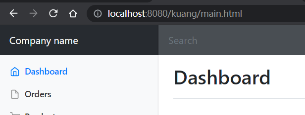
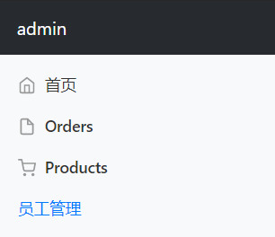
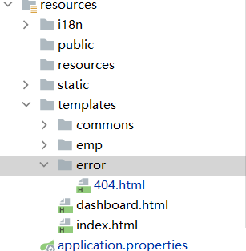

# 目录

- [目录](#目录)
- [启动器](#启动器)
- [理解SpringBoot](#理解springboot)
  - [自动导入配置](#自动导入配置)
- [各种@的意思](#各种的意思)
- [配置文件](#配置文件)
  - [YAML](#yaml)
    - [配置：](#配置)
  - [XML](#xml)
    - [配置](#配置-1)
  - [语法比较](#语法比较)
- [给属性赋值的几种方式](#给属性赋值的几种方式)
  - [步骤](#步骤)
  - [方式1和2比较](#方式1和2比较)
  - [方式1：类上@ConfigurationProperties(**最方便**)](#方式1类上configurationproperties最方便)
  - [方式2：在类的属性上@Value("") （适用于少数据）](#方式2在类的属性上value-适用于少数据)
  - [方式3：类上@PropertySource](#方式3类上propertysource)
  - [给属性随机赋值](#给属性随机赋值)
    - [${random.int/uuid/...}](#randomintuuid)
    - [${person.hello:hello}world](#personhellohelloworld)
- [使用JSR303进行数据校验](#使用jsr303进行数据校验)
- [多环境配置和配置文件](#多环境配置和配置文件)
  - [配置文件](#配置文件-1)
    - [优先级](#优先级)
  - [多环境配置](#多环境配置)
    - [properties配置（默认）](#properties配置默认)
    - [yaml配置（推荐）](#yaml配置推荐)
  - [总结](#总结)
- [自动装配原理](#自动装配原理)
- [SpringBoot Web开发](#springboot-web开发)
  - [静态资源](#静态资源)
    - [webjars](#webjars)
    - [总结](#总结-1)
  - [首页订制](#首页订制)
    - [图标](#图标)
    - [模板引擎](#模板引擎)
      - [导入thymeleaf引擎](#导入thymeleaf引擎)
      - [thymeleaf替换html元素](#thymeleaf替换html元素)
      - [th:text 和 th:utext的区别](#thtext-和-thutext的区别)
      - [th:each](#theach)
- [MVC配置原理](#mvc配置原理)
  - [**ContentNegotiatingViewResolver 内容协商视图解析器**](#contentnegotiatingviewresolver-内容协商视图解析器)
  - [解析器的使用](#解析器的使用)
- [员工管理系统](#员工管理系统)
  - [准备工作](#准备工作)
    - [导入lombok](#导入lombok)
  - [首页实现](#首页实现)
  - [国际化](#国际化)
    - [实现中英文按钮](#实现中英文按钮)
    - [自定义一个组件LocaleResolver](#自定义一个组件localeresolver)
    - [组件配置到Spring容器--@Bean](#组件配置到spring容器--bean)
  - [登录功能实现](#登录功能实现)
    - [实现登录按钮](#实现登录按钮)
    - [实现登录控制器](#实现登录控制器)
    - [设置视图](#设置视图)
  - [登录拦截器](#登录拦截器)
    - [写拦截器](#写拦截器)
    - [添加拦截路径](#添加拦截路径)
  - [展示员工列表](#展示员工列表)
    - [写员工控制器](#写员工控制器)
    - [简化list页面代码](#简化list页面代码)
    - [提取公共页面](#提取公共页面)
    - [实现高亮](#实现高亮)
    - [展示表格](#展示表格)
    - [增加员工实现](#增加员工实现)
      - [增加一个添加页面：](#增加一个添加页面)
      - [几个标签介绍：](#几个标签介绍)
      - [添加页面和调用业务](#添加页面和调用业务)
      - [设置date格式（yyyy-MM-dd）](#设置date格式yyyy-mm-dd)
  - [修改员工信息](#修改员工信息)
    - [实现编辑按钮](#实现编辑按钮)
  - [删除和404页面](#删除和404页面)
    - [删除](#删除)
    - [404页面](#404页面)
- [Q & A](#q--a)
  - [1. 出现plugins报错](#1-出现plugins报错)
  - [2. 输出出现乱码](#2-输出出现乱码)
  - [3. age: 3${random.int}报错](#3-age-3randomint报错)
  - [4. 解决导入import javax.validation失败](#4-解决导入import-javaxvalidation失败)
  - [5.单词缩写(i18n等)](#5单词缩写i18n等)
  - [6. 使用session的属性](#6-使用session的属性)
  - [7. 当出现xxxDao的方法一直是null时：](#7-当出现xxxdao的方法一直是null时)
  - [8. 点击button按钮一直不跳转](#8-点击button按钮一直不跳转)


# 启动器	

- ```xml
  <dependency>
      <groupId>org.springframework.boot</groupId>
      <artifactId>spring-boot-starter</artifactId>
  </dependency>
  ```

- 启动器即Spring_Boot的启动场景，比如`spring-boot-starter-web`，他会自动导入web环境所有依赖。
- Spring_Boot 会将所有的功能场景，都变成启动器。要什么功能，找对应启动器即可。

## 主程序

``` java
@SpringBootApplication // 标注这个类是springboot的应用
public class SpringBoot01HelloworldApplication {

    public static void main(String[] args) {
        SpringApplication.run(SpringBoot01HelloworldApplication.class, args);
    }

}
```


- ctrl + 鼠标左键 **@SpringBootApplication** 可看到：

```
@SpringBootConfiguration：
	@Configuration ： spring配置类
	
@EnableAutoConfiguration：
	@AutoConfigurationPackage：自动配置包
		@Import({Registrar.class})：导入选择器包注册
	@Import({AutoConfigurationImportSelector.class}):自动配置导入选择包

```


> SpringBootApplication这个类做了一下四件事：

1. 推断应用的类型是`普通/Web项目` （如果是普通项目，就退了；如果是Web项目，会一直运行）
2. 查找并加载所有可用初始化器，设置到initializes属性中
3. 找出所有的应用程序监听器，设置到listen属性中
4. 推断并设置main方法的定义类，找到运行的主类


# 各种@的意思

@Mapping

| @名字           | 含义                                                    |
| --------------- | ------------------------------------------------------- |
| @GetMapping     | 将HTTP GET请求映射到特定程序的注释，获取一些东西的请求  |
| @PostMapping    | 将HTTP Post请求映射到特定程序的注释，提交一些东西的请求 |
| @RequestMapping | 相当于以上两个注解的父类，可替换以上两个                |
| @PutMapping     | 更新请求                                                |
| @DeleteMapping  | 删除请求                                                |
| @MessageMapping |                                                         |


|         @名字         | 含义                                        |
| :-------------------: | ------------------------------------------- |
|      @Component       | 组件                                        |
|    @ComponentScan     | 自动找到Spring组件                          |
|      @Cacheable       |                                             |
|                       |                                             |
|      @Autowired       | 自动装配                                    |
|      @Qualifier       |                                             |
|        @Value         | 赋值                                        |
|      @Validated       | 数据校验                                    |
| @Email(message="xxx") | 被注释的元素必须是电子邮箱地址              |
|    @Configuration     | 适用于主类                                  |
|                       |                                             |
|        @Param         | 参数                                        |
|                       |                                             |
|        @import        | 导入额外配置类                              |
|    @ImportResource    | 加载XML配置文件                             |
|                       |                                             |
|     @PathVariable     | 可以用来映射URL中的占位符到目标方法的参数中 |
|                       |                                             |
|    @Transactional     |                                             |


@Enable

|              @名字               |     含义     |
| :------------------------------: | :----------: |
| @*EnableConfigurationProperties* | 自动配置属性 |
|                                  |              |
|                                  |              |

@ConditionalOn

|                  @名字                   |           含义           |
| :--------------------------------------: | :----------------------: |
| *ConditionalOnWebApplication(type = xx)* | 根据不同条件判断是否生效 |
|  @ConfigurationProperties(prefiex = "")  |      实体类的值配置      |
|                                          |                          |

@Response

|      @名字      |             含义             |
| :-------------: | :--------------------------: |
| @*ResponseBody* | 将java对象转为json格式的数据 |
|                 |                              |
|                 |                              |

@Controller

| @名字           | 含义 |
| --------------- | ---- |
| @RestController |      |
|                 |      |
|                 |      |

@Service

| @名字    | 含义 |
| -------- | ---- |
| @Service |      |
|          |      |
|          |      |


# 配置文件

SpringBoot使用的是全局的配置文件，文件名固定，后缀可变(可同时存在两个配置文件，如`application.yaml`&& `application.properties`)

application.`properties`
- 语法结构：key=value   

application.`yml/yaml`
- 语法结构：key：空格 value

**配置文件的作用：**修改SpringBoot自动配置的默认值，因为SpringBoot在底层都配置好了。


## YAML

YAML是”YAML Ain‘t a Markup Language“ （YAML不是一种标记语言）的递归缩写。

其本意是“Yet Another Markup Language”（仍是一种标记语言）。

> 强调以数据为中心，而非标记语言为中心。

### 配置：

```yaml
server:
	port : 8080
```


## XML

### 配置

```xml
<server>
    <port>8081</port>
</servers>
```


## 语法比较

1. **application.yaml:**

> **对空格要求很严格**

```yaml
Person:
  name: qin
  age: 3
  happy: true
  birth: 2020/3/3
  maps: {k1: v1,k2: v2}
  list:
    - code
    - music
    - girl
  dog:
    name: 旺财
    age: 3
```

2. **application.properties:**

   ```properties
   name=qin
   
   student.name = qin
   student.age = 3
   ```

   


# 给属性赋值的几种方式

​	**在pom.xml中加入：**

```yaml
<!--配置文件处理器，配置文件进行配置就会有提示-->
<dependency>
   <groupId>org.springframework.boot</groupId>
   <artifactId>spring-boot-configuration-processor</artifactId>
   <optional>true</optional>
</dependency>
```


## 步骤

```markdown
1. 配置文件处理器（配置后可能报错，需要maven-instal一下）
2. 类上@ConfigurationProperties（或其他方式）
3. 在yaml/yml中给类属性赋值
4. 在test类中运行该类
# 若运行失败，检查yaml是否编写有误
# 若运行test后乱码，见Q&A-2
```


## 方式1和2比较

|                             | @ConfigurationProperties | @Value     |
| --------------------------- | ------------------------ | ---------- |
| 功能                        | 批量注入配置文件中的属性 | 一个个指定 |
| 松散绑定                    | **支持**                 | 不支持     |
| SPEL（只有@PropertySource） | 不支持                   | **支持**   |
| JSR303数据校验              | **支持**                 | 不支持     |
| 复杂类型封装                | **支持**                 | 不支持     |

- 松散绑定：当类中的属性名（如aName)与pom.xml的属性名（如a-Name）相似，也可以绑定。
- JSR303数据校验：

## 方式1：类上@ConfigurationProperties(**最方便**)

给实体类@ConfigurationProperties(prefix = "")，然后在application.yaml中会自动找到对应的值。

> **例如：**
>
> **在实体类Person中：**

```java
@Component
@ConfigurationProperties(prefix = "person")
public class Person {

    private String name;
    private Integer age;
    private Boolean happy;
    private Date birth;
    private Map<String,Object> maps;
    private List<Object> lists;
    private Dog dog;
    ...
```

**在application.yaml中：**

```yaml
Person:
  name: qin
  age: 3
  happy: true
  birth: 2020/3/3
  maps: {k1: v1,k2: v2}
  list:
    - code
    - music
    - girl
  dog:
    name: 旺财
    age: 3
```

> ConfigurationProperties的作用：**将配置文件中的属性值，映射到这个组件中**；
>
> 让SpringBoot将**本类的所有属性和配置文件的进行绑定**，通过prefix = “person”与配置文件中的person所有值对应。


## 方式2：在类的属性上@Value("") （适用于少数据） 

> **例如：**
>
> ```java
> public class Dog {
>     @Value("旺财")
>     private String name;
>     @Value("3")
>     private Integer age;
>     ...
> ```


## 方式3：类上@PropertySource

@PropertySource(value = "classpath:test.properties")

> **例如在test.properties：**
>
> ```properties
> name=weng
> ```

> 注意若要用非application.properties的test.properties，须把application.properties的内容注释掉或者删掉该文件，否则新test.properties不生效。

​       如下图，引入weng.properties，@Value("${name}")映射name值，然后test即可：


## 给属性随机赋值

### ${random.int/uuid/...}

### ${person.hello:hello}world

> **例如：**
>
> ```yaml
> person:
> name: qin${random.uuid}
> age: 3${random.int}
> happy: true
> birth: 2020/3/3
> maps: {k1: v1,k2: v2}
> # hello: happy
> lists:
>     - code
>     - music
>     - girl
>   dog:
>     name: ${person.hello:hello}_旺财
>     age: 3

**Q：运行后发现${random.int}一直不行**	[解决方案](#3. age: 2${random.int}报错)


- 当person.hello存在，则选择；否之选择:后面的hello。

  

# 使用JSR303进行数据校验

- Ctrl + 左键 constraints：


> 如图：

```markdown
@Null		必须为null
@NotNull	必须不为null
@NotEmpty	必须不为空
...
```


# 多环境配置和配置文件

## 配置文件

### 优先级

- 配置文件(application.yaml)的目录（优先级从1-4递减，最高是1）：
  1. file:./config/		（file即项目根目录）
  2. file:./
  3. classpath:/config/   (类路径，即java/com.xxx.xxx/或resources/下)
  4. classpath:/
- 若在如上1-4的目录下，同时出现多个yaml配置文件，然后分别配置port端口号为8081-8084，会优先查找1、2、3和4的。

## 多环境配置

### properties配置（默认）

- 适用于区别不同环境，如dev环境（8082）和test环境（8083）。

> 例如：

```properties
application.properties：

#springBoot的多环境配置，可以选择激活哪一个配置文件
spring.profiles.active=dev/test
```

```properties
application-dev.properties:

server.port=8082
```

```properties
application-test.properties:

server.port=8083
```

此时启动程序，会选择`application-dev`的端口号8081;

若是`spring.profiles.active=test`则会选择`application-test`的端口号8082。


### yaml配置（推荐）

用yaml则更方便，只需1个文件：

```yaml
application.yaml:

server:
  port: 8081
spring:
  profiles:
  	active: dev/test
  	
---
server:
  port: 8082
spring:
  profiles: dev
  	
---
server:
  port: 8083
spring:
  profiles: test
```

- 默认情况下，会激活最外层的8081，当active为dev则激活dev的8082端口，若为test则为8083端口。

**注意：如果yaml和properties同时配置了端口，并且没激活其他环境，默认选择properties配置文件。**


## 总结

​	在yaml里配置的东西，


# 自动装配原理

1. SpringBoot启动会加载大量的自动配置类
2. 看需要功能有没有在SpringBoot默认写好的自动配置类中
3. 自动配置类配置的组件（只要我们要用的组件在其中，我们就不需要再手动配置）
4. 给容器中自动配置类添加组件的时候，会从properties类中获取某些属性。

- xxx.AutoConfiguration：自动配置类；给容器中添加组件

- xxxProperties：封装配置文件中相关属性


1. 

```yaml
application.yaml：

# 查看哪些自动配置类生效，哪些没有生效
debug: true;
```

2. 启动程序，会发现输出中有Positive matches 和 Nagative matches，前者表示的是自动配置类匹配成功，后者匹配失败。


# SpringBoot Web开发

jar：webapp

自动装配

要解决的问题：

- 导入静态资源...
- 首页
- jsp，模板引擎Thymeleaf
- 装配扩展SpringMVC
- 增删改查
- 拦截器
- 国际化

## 静态资源

 ### webjars

- 导入想要的webjars依赖：

[webjars链接](webjars.org)

- 找到对应的jquery.js：

http://localhost:8080/webjars/jquery/3.6.0/jquery.js

```java
WebMvcAutoConfiguration：

addResourceHandlers(ResourceHandlerRegistry registry){
	if (!this.resourceProperties.isAddMappings()) {
                logger.debug("Default resource handling disabled");
            } else {}
}
```

- 在此方法的`isAddMappings()`中，我们可以获取静态地址`CLASSPATH_RESOURCE_LOCATIONS`，如下1-4。

```java
1."classpath:/META-INF/resources/", 2."classpath:/resources/", 	  （放uploud文件）
3."classpath:/static/", 	 （放静态资源，如图片）
4."classpath:/public/"				（放公共资源）
```

- 如上四个地址都可以通过`localhost:8080/`访问。


- 如图，resources/resources，resources/static，resources/public分别对应2-4类路径。访问的时候，会自动按顺序去这四个路径找对应文件。	

  > 例如：
  >
  > 如图resources/public/1.js的内容是hello，我们可以通过localhost:8080/1.js访问。

  

- 也可以自定义一个路径，在application.properties中，输入spring.mvc.static-path-pattern=/weng/** **（最好别用，用了之后resources下的会失效）**

### 总结

1. 在SpringBoot中，以下方式可处理静态资源：
   1. webjars ： `localhost:8080/webjars/`
   2. public, static, /**, resources   `localhost:8080/`
2. 优先级：`resources` > `static`（默认） > `public `


## 首页订制

- 比如在`resources`或`static`或`public`文件夹中放置index.html

```html
<!DOCTYPE html>
<html lang="en">
<head>
    <meta charset="UTF-8">
    <title>Title</title>
</head>
<body>

<h1>首页resources/static/public</h1>

</body>
</html>
```

- 那么正如静态资源-总结所说，当我们访问`localhost:8080`时会按1.resources/ 2.static/ 3.public顺序去找这个index.html。


在templates目录下的所有页面，只能通过controller来跳转。

> 例如在controller/目录下：
>
> ```java
> @RequestMapping("/index")
> 
> ```


### 图标

- 图标放在`resources/public`里，名字为`favicon.ico`。

```properties
application.properties：
# 关闭默认图标
spring.mvc.favicon.enabled=false 
```

**注意：以上图标操作 2.0 版本之后已经失效！**

- 现在只需要放在static里，命名为favicon.ico即可自动识别。


### 模板引擎

- [模板引擎的语法](https://www.thymeleaf.org/doc/tutorials/3.0/usingthymeleaf.html#standard-expression-syntax)


#### 导入thymeleaf引擎

- 某页面导入thymeleaf：

```html
<html lang="en" xmlns:th="https://www.thymeleaf.org/">...</html>
```

- 在templates目录下的所有页面，只能通过controller来跳转！这个需要模板引擎的支持：thymeleaf。

 总结：如果需要使用Thymeleaf，只需要导入相应的依赖即可！我们将html放在我们的`templates`目录下。

```xml
<!-- 导入thymeleaf -->
        <dependency>
            <groupId>org.thymeleaf</groupId>
            <artifactId>thymeleaf-spring5</artifactId>
        </dependency>
        <dependency>
            <groupId>org.thymeleaf.extras</groupId>
            <artifactId>thymeleaf-extras-java8time</artifactId>
        </dependency>
```

#### thymeleaf替换html元素

- 所有的html元素都可以被thymeleaf替换接管：th:元素名

  > 例如：

```html
<!DOCTYPE html>
<html lang="en" xmlns:th="https://www.thymeleaf.org/">
<head>
    <meta charset="UTF-8">
    <title>Title</title>
</head>
<body>

    <div th:text="${msg}"></div>

</body>
</html>
```

```java
../templates/indexController.java：
import org.springframework.stereotype.Controller;
import org.springframework.web.bind.annotation.RequestMapping;
import org.springframework.ui.Model;

@Controller
public class indexController {

    @RequestMapping("/test")
    public String index(Model model){
        model.addAttribute("msg","hello,springBoot!");
        return "test";
    }
}

```

#### th:text 和 th:utext的区别

```html
某个html：
<div th:text="${msg}"></div>
<div th:utext="${msg}"></div>
```

```java
@Controller
public class indexController {

    @RequestMapping("/test")
    public String index(Model model){
        model.addAttribute("msg","<h1>hello,springBoot!</h1>");
        return "test";
    }
}
```


#### th:each

```java
model.addAttribute("users", Arrays.asList("weng", "acChris"));
```

```html
某个html中：
<hr>
(建议)<h3 th:each="user:${users}" th:text="${user}"></h3>
// 或写成：
// <h3 th:each="user:${users}">[[ ${user} ]]</h3>

```


[详细语法](https://www.thymeleaf.org/doc/tutorials/3.0/usingthymeleaf.html#standard-expression-syntax)

# MVC配置原理

- [官方文档](https://docs.spring.io/spring-boot/docs/2.2.5.RELEASE/reference/htmlsingle/#boot-features-spring-mvc-auto-configuration)

  

```markdown
# SpringBoot为Spring MVC 提供自动配置，适用于大部分应用程序。
Spring MVC Auto-configuration
Spring Boot provides auto-configuration for Spring MVC that works well with most applications.
//自动配置添加了以下功能：
The auto-configuration adds the following features on top of Spring’s defaults:
# 包括ContentNegotiatingViewResolver 和 BeanNameViewResolver beans 
Inclusion of ContentNegotiatingViewResolver and BeanNameViewResolver beans.
# 支持服务静态资源，包括支持webjars（文档之后会说明）
Support for serving static resources, including support for WebJars (covered later in this document)).
# 自动注册 转换器，通用转换器 和 格式器 beans
Automatic registration of Converter, GenericConverter, and Formatter beans.
# 支持http消息转换器
Support for HttpMessageConverters (covered later in this document).
# 自动注册 消息代码解析器
Automatic registration of MessageCodesResolver (covered later in this document).
# 支持静态 主页
Static index.html support.
# 支持 自定义图标
Custom Favicon support (covered later in this document).
# 可配置的网页绑定初始化
Automatic use of a ConfigurableWebBindingInitializer bean (covered later in this document).
# 如果你希望保留SpringBootMVC功能，并且希望添加新功能，你可以在WebMvcConfigurer类型的类上添加@Configuration，但不添加@EnableWebMvc
If you want to keep those Spring Boot MVC customizations and make more MVC customizations (interceptors, formatters, view controllers, and other features), you can add your own @Configuration class of type WebMvcConfigurer but without @EnableWebMvc.
# 如果你想提供RequestMappingHandlerMapping, RequestMappingHandlerAdapter, or ExceptionHandlerExceptionResolver的自定义实例，并且保持SpringBootMVC自定义，你可以声明一个WebMvcRegistrations类型的bean并且使用它去提供那些组件的自定义实例
If you want to provide custom instances of RequestMappingHandlerMapping, RequestMappingHandlerAdapter, or ExceptionHandlerExceptionResolver, and still keep the Spring Boot MVC customizations, you can declare a bean of type WebMvcRegistrations and use it to provide custom instances of those components.
# 如果你想完全控制MVC，你可以添加你自己的@Configuration，并带有@EnableWebMvc注释，或者添加你自己的@Configuration-annotated，就像@EnableWebMvc的javadoc里面描述的一样
If you want to take complete control of Spring MVC, you can add your own @Configuration annotated with @EnableWebMvc, or alternatively add your own @Configuration-annotated DelegatingWebMvcConfiguration as described in the Javadoc of @EnableWebMvc.
```


## **ContentNegotiatingViewResolver 内容协商视图解析器**

- 找到WebMvcAutoConfiguration ，然后搜索ContentNegotiatingViewResolver，找到方法：

  - ```java
    @Bean
    @ConditionalOnBean(ViewResolver.class)
    @ConditionalOnMissingBean(name = "viewResolver", value = ContentNegotiatingViewResolver.class)
    public ContentNegotiatingViewResolver viewResolver(BeanFactory beanFactory) {
        ContentNegotiatingViewResolver resolver = new ContentNegotiatingViewResolver();
        resolver.setContentNegotiationManager(beanFactory.getBean(ContentNegotiationManager.class));
        // ContentNegotiatingViewResolver使用所有其他视图解析器来定位视图，因此它应该具有较高的优先级
        resolver.setOrder(Ordered.HIGHEST_PRECEDENCE);
        return resolver;
    }
    ```


## 解析器的使用

- 使用解析器：自己写一个静态的解析器类，然后在bean里面实例化即可。


```java
/*
如果你想一些定制化功能，只要写这个组件，然后将它交给springboot，springboot就会自动装配
扩展springmvc   dispatchservlet
* */

@Configuration
//实际上是导入一个类 DelegatingWebMvcConfiguration
//@EnableWebMvc

public class MyMvcConfig implements WebMvcConfigurer {

//    ViewResolver 实现了视图解析器的类，我们就可以把它看做视图解析器
    @Bean
    public ViewResolver myViewResolver() {
        return new MyViewResolver();
    }
    // 视图跳转
    @Override
    public void addViewControllers(ViewControllerRegistry registry) {
        registry.addViewController("/kuang").setViewName("test");
    }

    // 自定义了一个自己的视图解析器MyViewResolver
    public static class MyViewResolver implements ViewResolver {
        @Override
        public View resolveViewName(String s, Locale locale) throws Exception {
            return null;
        }
    }
}
```

- 当进入kuang页面会自动跳转到test中，只有横线是因为没有传递数据


```
WebMvcAutoConfiguration：
@ConditionalOnMissingBean({WebMvcConfigurationSupport.class})

//实际上是导入一个类 DelegatingWebMvcConfiguration
@EnableWebMvc
public class MyMvcConfig implements WebMvcConfigurer{...}

public class DelegatingWebMvcConfiguration extends WebMvcConfigurationSupport {
```

- 此时若注解@EnableWebMvc，则导入类DelegatingWebMvcConfiguration，然后WebMvcConfigurationSupport.class就会存在。若WebMvcConfigurationSupport.class存在，则自动配置类WebMvcAutoConfiguration.java不生效，运行会Error Page。所以，不能加上@EnableWebMvc。


**总结：在springboot中，有非常多的xxx Configuration类，当其存在时会帮助我们进行扩展配置，所以遇到它时要立马查看到底扩展了什么类。**


# 员工管理系统

## 准备工作

### 导入lombok

```xml
<!--导入lombok-->
<dependency>
    <groupId>org.projectlombok</groupId>
    <artifactId>lombok</artifactId>
</dependency>
```

## 首页实现

```java
@Configuration
public class MyMvcConfig implements WebMvcConfigurer {

    @Override
    public void addViewControllers(ViewControllerRegistry registry) {
        registry.addViewController("/").setViewName("index");
        registry.addViewController("/index.html").setViewName("index");
    }
}
```


- ```html
  在html中导入命名空间，以便使用thymeleaf
  <html lang="en" xmlns:th="http://www.thymeleaf.org">
  ```

- 如上，将thymeleaf 引入index.html中，例如样式链接<link>和，统一为 th:xxx="@{...} ，即可使用thymeleaf

- 例如："th:href="@{...}" 或 th:src="@{...}"


```properties
application.properties:

# 配置首页
server.servlet.context-path=/kuang
```

- 之后便可访问 localhost:8080/kuang，如图：


## 国际化


- 如图，resources下创建login的三个语言配置文件，在下方点击Resource Bundle，使其可视化：


- 可点上图上方的 + 号，添加当前login页面的相应控件的不同语言：


### 实现中英文按钮

- 在页面的相应按钮处更改如图：

```html
<a class="btn btn-sm" th:href="@{/index.html(l='zh_CN')}">中文</a>
<a class="btn btn-sm" th:href="@{/index.html(l='en_US')}">English</a>
```

### 自定义一个组件LocaleResolver

```java
public class MyLocaleResolver implements LocaleResolver {

    @Override
    public Locale resolveLocale(HttpServletRequest httpServletRequest) {
        //获取请求中的语言参数
        String language = httpServletRequest.getParameter("l");

//        System.out.println(language);
        // 如果没有就使用默认的
        Locale locale = Locale.getDefault();

        //
        if(!StringUtils.isEmpty(language)){
            //zh_CN
            String[] split = language.split("_");
            //国家，地区
            locale = new Locale(split[0], split[1]);
        }
        return locale;
    }

    @Override
    public void setLocale(HttpServletRequest httpServletRequest, HttpServletResponse httpServletResponse, Locale locale) {

    }
}
```

### 组件配置到Spring容器--@Bean

- 记得将自己写的组件配置到Spring容器中，即@Bean

```java
public class MyMvcConfig implements WebMvcConfigurer {

    @Override
    public void addViewControllers(ViewControllerRegistry registry) {
        registry.addViewController("/").setViewName("index");
        registry.addViewController("/index.html").setViewName("index");
    }

    // *自定义的国际化组件就生效
    @Bean
    public LocaleResolver localeResolver(){
        return new MyLocaleResolver();
    }
}
```


## 登录功能实现

### 实现登录按钮

- 实现按钮 登录 后跳转到某一页面：

```html
<form class="form-signin" th:action="@{/user/login}">...</form>
```

### 实现登录控制器

- 实现`loginController`，实现登录成功 or 失败两种业务：

  - ```java
    @Controller
    public class loginController {
    
        @RequestMapping("/user/login")
        public String login(
                @RequestParam("username") String username,
                @RequestParam("password") String password,
                Model model){
    
            //具体业务：
            if (!StringUtils.isEmpty(username) && "123456".equals(password)){
                return "redirect:/main.html";
            }else{
                // 告诉用户：登录失败
                model.addAttribute("msg","用户名或密码错误");
                return "index";
            }
        }
    }
    
    ```

### 设置视图

- 在MyMvcConfig中设置视图：

  - ```java
    @Configuration
    public class MyMvcConfig implements WebMvcConfigurer {
    
        @Override
        public void addViewControllers(ViewControllerRegistry registry) {
            registry.addViewController("/").setViewName("index");
            registry.addViewController("/index.html").setViewName("index");
            registry.addViewController("/main.html").setViewName("dashboard");
        }
    
        // 自定义的国际化组件就生效
        @Bean
        public LocaleResolver localeResolver(){
            return new MyLocaleResolver();
        }
    }
    ```

**登录页面：**




## 登录拦截器

### 写拦截器

```java
public class LoginHandlerInterceptor  implements HandlerInterceptor {

    @Override
    public boolean preHandle(HttpServletRequest request, HttpServletResponse response, Object handler) throws Exception {

        //登录成功后，应该有用户的session
        Object loginUser = request.getSession().getAttribute("loginUser");

        //没登录
        if(loginUser == null){
            request.setAttribute("msg","没有权限，请先登录");
            request.getRequestDispatcher("/index.html").forward(request,response);
            return false;
        }else{
            return true;
        }
    }
}
```

### 添加拦截路径

```java
public class MyMvcConfig implements WebMvcConfigurer {
    ...
    public void addInterceptors(InterceptorRegistry registry) {
        registry.addInterceptor(new LoginHandlerInterceptor())     .addPathPatterns("/**").excludePathPatterns("/index.html","/","/user/login","/css/*","/js/**","img/**");
    }
}
```


## 展示员工列表

### 写员工控制器

```java
@Controller
public class EmployeeController {

    @Autowired
    EmployeeDao employeeDao;

    @RequestMapping("/emps")
    public String list(Model model){
        Collection<Employee> employees = employeeDao.getAll();
        model.addAttribute("emps",employees);
        return "emp/list";
    }
}
```

### 简化list页面代码

- th:fragment格式：th: insert = "~{xxx::xx}" （xxx::xx  ☞某页面的xx分块）

- 将dashboard的员工管理分块，然后展示在list页面

```html
dashboard.html
<nav class="col-md-2 d-none d-md-block bg-light sidebar" th:fragment="sidebar">...</nav>
```

```html
list.html
<!--引入dashboard.html的siderbar-->
<div th:insert="~{dashboard::sidebar}"></div>
```

### 提取公共页面

- 简化dashboard和list页面：通过一个Commons.html把公共部分抽取出来，然后用th:replace调用

  - ```html
    dashboard.html / list.html
    
    <!--引入导航-->
    <div th:replace="~{commons/commons::topbar}"></div>	
    ....
    <!--侧边栏-->
    <div th:replace="~{commons/commons::sidebar}"></div>
    ```

  - ```html
    commons.html
    
    <!--头部导航栏-->
    <nav class="navbar navbar-dark sticky-top bg-dark flex-md-nowrap p-0" th:fragment="topbar">...</nav>
    ...
    <!--侧边栏-->
    <nav class="col-md-2 d-none d-md-block bg-light sidebar" th:fragment="sidebar">...</nav>
    ```


### 实现高亮

- 实现点击侧边栏的员工管理，使得只有员工管理栏高亮：

- 语法如下三个html：

  ```html
  commons.html
  
  <a class="nav-link" href="http://getbootstrap.com/docs/4.0/examples/dashboard/#">...</a>
  <a th:class="${active == 'list.html'?'nav-link active':'nav-link'}" th:href="@{/emps}">
      员工管理
  </a>
  ```

  ```html
  dashboard.html
  
  <!--侧边栏-->
  <!--传递参数给组件-->
  <div th:replace="~{commons/commons::sidebar(active='main.html')}"></div>
  ```

  ```html
  list.html
  
  <!--侧边栏-->
  <div th:replace="~{commons/commons::sidebar(active='list.html')}"></div>
  ```




### 展示表格  

- 使用语法遍历元素：th:each="xxx:${xxxs}"	如emp:${emps}

```html
list.html

...
<table class="table table-striped table-sm">
   <thead>
      <tr>
         <th>id</th>
         <th>lastName</th>
         <th>email</th>
         <th>gender</th>
         <th>department</th>
         <th>birth</th>
      </tr>
   </thead>
   <tbody>
      <tr th:each="emp:${emps}">
         <td th:text="${emp.getId()}"></td>
          <td th:text="${emp.getLastName()}"></td> 或
          <td>[[  ${emp.getLastName()}  ]]</td>
         <td th:text="${emp.getEmail()}"></td>
         <td th:text="${emp.getGender()}"></td>
         <td th:text="${emp.department.getDepartmentName()}"></td>
         <td th:text="${emp.getBirth()}"></td>
      </tr>
   </tbody>
</table>
...
```

- 如图：


```html
增加编辑和删除按钮，更正gender和birth格式，如下图：
<td th:text="${emp.getGender() == 0 ? '女' : '男'}"></td>
<td th:text="${#dates.format(emp.getBirth(),'yyyy-MM-dd HH:mm:ss')}"></td>
<td>
	<button class="btn btn-sm btn-primary">编辑</button>
	<button class="btn btn-sm btn-danger"> 删除</button>
</td>
```


### 增加员工实现

#### 增加一个添加页面：

#### 几个标签介绍：

| 标签     | 标签属性                                            | 属性含义                                    |
| :------- | --------------------------------------------------- | ------------------------------------------- |
| < label >  | for="male"                                          | 与< input >其同时使用。for的male对应input的id |
| < input >  | type="radio/text/email"，name，id，value            | 类型，名称，id，值                          |
| < button > | type="submit"   class="btn btn-primary/btn-default" | 按钮功能为提交，class为样式                 |
|          |                                                     |                                             |
|          |                                                     |                                             |


```html
add.html --> list.html

<main role="main" class="col-md-9 ml-sm-auto col-lg-10 pt-3 px-4">
	
    // action是表单跳转到/emp，方法是post，也就是说会跳转到EmployeeController的@PostMapping中
   <form th:action="@{/emp}" method="post">
      <!--               名字-->
      <div class="form-group">
         <label>LastName</label>
         <input type="text" name="lastName" class="form-control"  placeholder="lastName">
      </div>
      <!--               邮箱-->
      <div class="form-group">
         <label>Email</label>
         <input type="email" name="email" class="form-control"  placeholder="Email">
      </div>

      <!--               性别-->
      <div class="form-group">
         <label>Gender</label><br/>
         <div class="form-check form-check-inline">
            <input class="form-check-input" type="radio" name="gender" value="1">
            <label class="form-check-label">男</label>
         </div>
         <div class="form-check form-check-inline">
            <input class="form-check-input" type="radio" name="gender" value="0">
            <label class="form-check-label">女</label>
         </div>
      </div>

      <!--               部门-->
      <div class="form-group">
         <label>department</label>
         <select class="form-control" name="department.id">
            <option th:each="dept:${departments}"
                  th:text="${dept.getDepartmentName()}"
                  th:value="${dept.getId()}"></option>
         </select>
      </div>

      <!--               生日-->
      <div class="form-group">
         <label>Birth</label>
         <input type="text" name="birth" class="form-control" placeholder="birth">
      </div>
      <button type="submit" class="btn btn-default">添加</button>
   </form>
</main>
```


#### 添加页面和调用业务

```java
EmployeeController
    
    // 查询部门全部信息并返回到list.html中
@RequestMapping("/emp")
    public String toAddPage(Model model){
        //查出所有部门的信息
        Collection<Department> departments = dapartmentDao.getDepartment();
        model.addAttribute("departments", departments);
        return "emp/add";
    }
	
	// 添加操作保存
    @PostMapping("/emp")
    public String addEmp(Employee employee){
//        System.out.println(employee.getDepartment().getId());
        employeeDao.save(employee); //调用底层业务方法保存员工信息
        //添加的操作
        return "redirect:/emps";
    }
```


#### 设置date格式（yyyy-MM-dd）

在application.properties中：`spring.mvc.format.date=yyyy-MM-dd`


## 修改员工信息

### 实现编辑按钮

```html
<a class="btn btn-sm btn-primary" th:href="@{'/emp/' + ${emp.getId()}}">编辑</a>
```

```html
拼接字符串大致有如下方法：
1. th:href="@{/emp/{id}(id=${emp.id})}

2. th:href="@{'/emp/' + ${emp.getId()}}

3. th:href="@{/emp/(${emp.id})}
```

- 实现点击编辑，然后去员工的修改界面：

  - ```html
    list.html
    
    <td>
       <a class="btn btn-sm btn-primary" th:href="@{'/emp/' + ${emp.getId()}}">编辑</a>
       <a class="btn btn-sm btn-danger"> 删除</a>
    </td>
    ```

  - ```java
    EmployeeController.java
        
    //去员工的修改页面
    @GetMapping("/emp/{id}")
    public String toUpdateEmp(@PathVariable("id")Integer id, Model model){
        //查出原来的数据
        Employee employee = employeeDao.getEmployeeById(id);
        model.addAttribute("emp",employee);
    
        //查出所有部门信息
        Collection<Department> departments = dapartmentDao.getDepartment();
        model.addAttribute("departments", departments);
        return "emp/update";
    }
    ```

- 以add.html为模板创建update.html，然后对其对下修改：

  ```html
  # 表单修改
  <form th:action="@{/updateEmp}" method="post">
  EmployeeController对应新增controller：
  	@PostMapping("/updateEmp")
      public String updateEmp(Employee employee){
          employeeDao.save(employee);
          return "redirect:/emps";
      }
  # <!--隐藏ID值，避免修改后ID自增				-->
  	<input type="hidden" name="id" th:value="${emp.getId()}">
  # 由于是修改界面，需要显示原本有的东西，故根据ID给每个input修改为其值：
      <label>LastName</label>
  		<input th:value="${emp.getLastName()}"...
      <label>Email</label>
  		<input th:value="${emp.getEmail()}"...
      # 单选框：th:checked
      <label>Gender</label><br/>
  		<div class="form-check form-check-inline">
  			<input th:checked="${emp.getGender()==1}"...男
  	<div class="form-check form-check-inline">
  		<input th:checked="${emp.getGender()==0}"...女
      # 修改获取的日期格式
      <label>Birth</label>
  		<input th:value="${#dates.format(emp.getBirth(), 'yyyy-MM-dd HH:mm:ss')}"
  ```


## 删除和404页面

### 删除

```html
list.html

<a class="btn btn-sm btn-danger"  th:href="@{'/delemp/' + ${emp.getId()}}"> 删除</a>
```

- 这里的意思类似于编辑，会自动映射到相应的Controller中：

```java
EmployeeController.java

//删除员工
@GetMapping("/delemp/{id}")
public String deleteEmp(@PathVariable("id")int id){
    employeeDao.deleteById(id);
    return "redirect:/emps";
}
```

- 如图，DDEE已删除，实现了删除功能。


### 404页面

- 非常简单，根据SpringBoot的配置，只需要把404.html放在resources/templates/error中即可，如



- localhost:8080/kuang/xxx，该页面不存在即自动跳转到404.html


## 整合JDBC使用

1. 导入JDBC、MYSQL Driver依赖后，resources下创建一下文件：

```properties
application.yml

spring:
	datasource:
		username:root
		password:xxxxx
		url: jdbc:mysql://localhost:3306/mybatis?serverTimezone=Asia/Shanghai&useUnicode=true&characterEncoding=utf-8
		driver-class-name: com.mysql.jdbc.Driver
```

2. 查看 和 操作数据源：

```java
@Autowired
DataSource dataSource;

// 查看默认数据源
dataSource.getClass();

// 获得数据库连接
Connection connection = dataSource.getConnection();

// 关闭连接
connection.close();
```

3. 新建JDBCController：

```java
@Autowired
JdbcTemplate jdbcTemplate;

// 查询数据库的所有信息
// 无实体类，如何获取数据？
@GetMapping("/userList")
// 通过localhost:8080/userList可以查看list_maps
public List<Map<String, Object>> userList(){
        String sql = "select * from user";
    List<Map<String, Object>> list_maps = jdbcTemplate.queryForList(sql);
    return list_maps;
}

// 更新User
@GetMapping("/userList")
public String addUser(){
    String sql = "insert into mabatis.user(id, name,pwd) values(4,'小明','123456')";
    jdbcTemplate.update(sql);
    return "update_ok";
}

// 更新user
@GetMapping("/updateUser/{id}")
public String updateUser(@PathVariable("id") int id){
    String sql = "update mabatis.user set name = ? ,pwd=? where id = " + id;
    
    // 封装
    Object[] objects = new Object[2];
    objects[0] = "小明2";
    objects[1] = "sss";
    jdbcTemplate.update(sql, objects);
    return "update_ok";
}

// 删除user
public String deleteUser(@PathVariable("id") int id){
    String sql = "delete from mabatis.user where id = "+ id;
    jdbcTemplate.update(sql, id);
    return "delete_ok";
}
```

总结：SpringBoot 已经写好JdbcTemplate，你要做到仅仅是配置数据源，即1.，然后直接自动装配使用即可。

  通过JdbcTemplate你可以查询(queryForxx)或更新(update)数据等，通过DataSource你可以获取数据库连接(getConnection)等。

## Druid

Druid 是阿里巴巴开源的，JDBC数据库连接池。可以监控数据库访问性能，SQL执行日志等。

连接池还有：SpringBoot 自带的tomcat jdbc、HikariCP数据库连接池。

```properties
# springboot 默认不注入属性，需自行绑定
# druid 数据源专有配置
spring:
	datasource:
	
        initial-size=5
        max-active=5
        min-idle=20
        max-wait=60000
        time-between-eviction-runs-millis=60000
        min-evictable-idle-time-millis=300000
        test-on-borrow=false
        test-on-return=false
        test-while-idle=true 
        validation-query=SELECT 1 FROM DUAL
        validation-query-timeout=1000
        keep-alive=true 
        remove-abandoned=true 
        remove-abandoned-timeout=180
        1og-abandoned=true 
        pool-prepared-statements=true 
        max-pool-prepared-statement-per-connection-size=20
        
        filters=stat, wall, slf4j 
        useGlobalDataSourceStat=true 
        preparedStatement=true 
        maxOpenPreparedStatements=100
        connect-properties.mergeSql=true 
        connect-properties. slowSqlMillis=5000
```

```java
// 使用Druid
public class DruidConfig{
    
    @Bean
    @COnfigurationProperties(prefiex = "spring.dataource")
    public DataSource druidDataSource(){
        return new DruidDataSource();
    }
    
    // 后台监控	 web.xml,ServletRegistrationBean
    // SpringBoot 内置了 Servlet容器，所以没有web.xml，替代方法：ServletRegistrationBean
    public ServletRegistrationBean statViewServlet(){
        ServletRegistrationBean<StatViewServlet> bean = new ServletRegistrationBean<>(new StatViewServlet());
        
        // 后台需配置账号密码
        HashMap<String, String> initParameters = new HashMap<>();
        // 增加配置
     	initParameters.put("loginUsername","admin"); // 登录key名loginUsername固定，不可修改
     	initParameters.put("loginPassword","123456");// 登录key loginPassword固定，不可修改
        // 允许谁可以访问
        initParameters.put("allow", "localhost"); // key 固定，value为访问人
        // 禁止谁可以访问
        // initParameters.put("acchris", "192.168.31.xxx");
            
        bean.setInitParameters(initParameters); // 设置初始化参数
    	return bean;
    }
}
```

​	

# Q & A

## 	1. 出现plugins报错

- Maven-install即可


## 2. 输出出现乱码 

- 2.1 修改 IDEA 开发环境的 File - Setting - Editor - File Encodings 中的Encoding，如图：


-  2.2 编辑器的乱码，解决方法是在File - Setting - Appearance中把name勾上，如图：


## 3. age: 3${random.int}报错

- 把2去掉即可，此处为语法错误。

## 4. 解决导入import javax.validation失败

  ```yaml
  <!--解决import javax.validation-->
  <dependency>
     <groupId>org.hibernate.validator</groupId>
     <artifactId>hibernate-validator</artifactId>
     <version>6.0.0.Final</version>
  </dependency>
  ```

## 5.单词缩写(i18n等)

**格式：首字母 + 中间字母个数 + 尾字母**

- **i18n** ：international
- **k8s**  ：Kubemetes

## 6. 使用session的属性

- 使用session的loginUser：

```html
<a>[[${session.loginUser}]]</a>
```

## 7. 当出现xxxDao的方法一直是null时：

- 检查xxxDao的实例是否@AutoWired即自动装配否，如：

```
@Autowired
private  DepartmentDao departmentDao;
```

## 8. 点击button按钮一直不跳转

- button换成a试试，< a href=""></ a>

